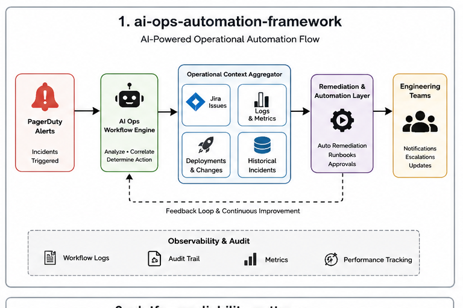

# AI Ops Automation Framework

This repository contains reference workflows, architecture examples, and operational automation patterns focused on reducing engineering friction across platform and support operations.

The goal is not to replace engineers.

The focus is improving operational efficiency by automating repetitive workflows around:

* incident response
* on-call operations
* operational visibility
* support escalation
* workflow orchestration
* engineering productivity

Many engineering organizations spend significant time on repetitive operational work that slows delivery and increases support overhead. These examples are intended to demonstrate how AI-assisted workflows and automation tooling can improve operational maturity while allowing engineers to focus on higher-value platform and product work.

## Areas Covered

* PagerDuty workflow automation
* Jira operational integrations
* AI-assisted incident triage
* Centralized operational intelligence
* Workflow remediation automation
* Engineering support automation
* Operational observability patterns

## Example Use Cases

### AI-Assisted Incident Triage

Automates:

* incident context collection
* ownership routing
* log aggregation
* related deployment identification
* historical incident correlation

### Operational Workflow Automation

Examples include:

* automated restart workflows
* failure remediation patterns
* operational runbook execution
* support escalation reduction

### Engineering Productivity Workflows

Examples include:

* PR review assistance
* operational summarization
* workflow scaffolding
* engineering knowledge systems

## Architecture Themes

* Event-driven workflows
* Operational observability
* Workflow orchestration
* AI-assisted automation
* Distributed systems operations
* Platform reliability

## Disclaimer

Examples are intentionally simplified and generalized for educational and architectural demonstration purposes.

## Reference Architecture

